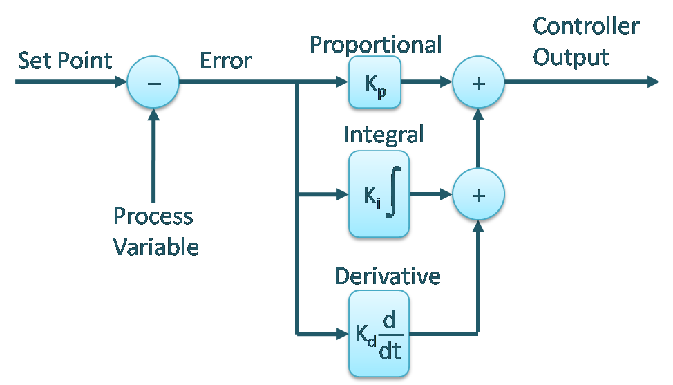
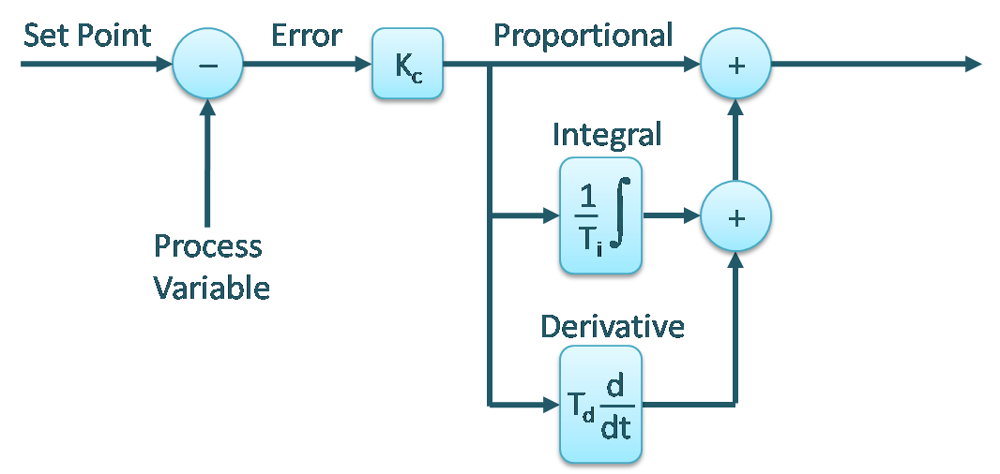
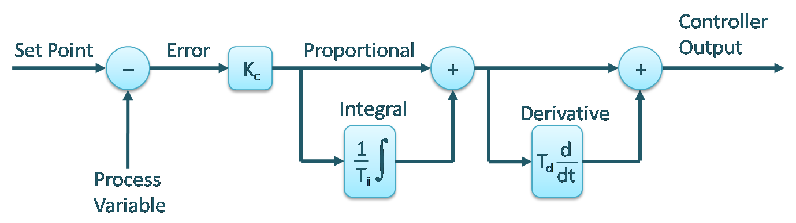
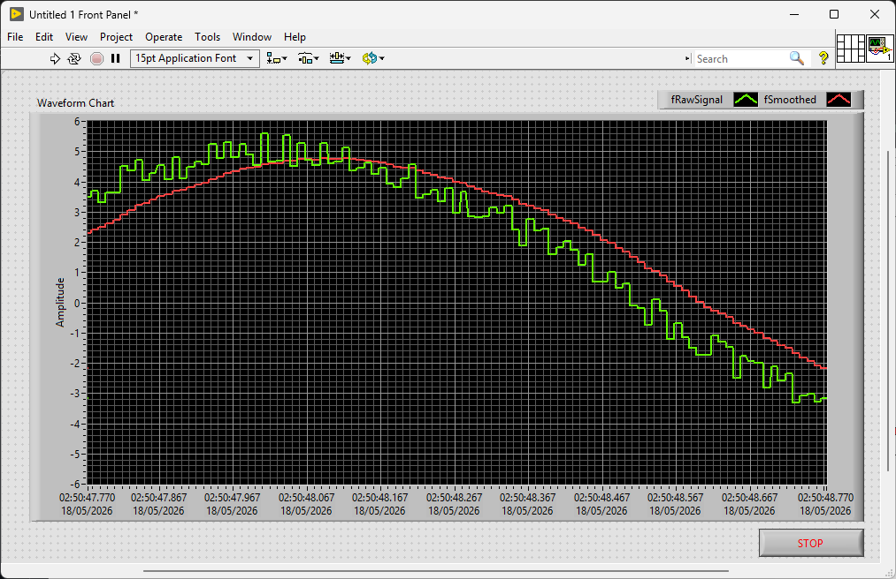

# FisoThemes' Controller Toolbox for TwinCAT

## Overview

A library of composable building blocks for modelling and building control systems in TwinCAT. Rather than providing a single monolithic PID block, the library exposes individual signal generators, plant simulators, controller components, filters, and signal conditioning blocks that can be wired together to suit the application.

## Dependencies

FsControllerToolbox depends on the following libraries:
- **[FsCommon](https://github.com/fisothemes/FisoThemes-Common-Library-for-TwinCAT):** Provides common data structures and utilities.

## Library Structure

| Category         | Description                                                   |
|------------------|---------------------------------------------------------------|
| **Signals**      | Periodic and aperiodic signal generators (sine, square, triangle, sawtooth, PWM, ramp). |
| **Simulation**   | Discrete-time plant models for closed-loop testing.           |
| **Control**      | Proportional, integral, and derivative controller components. |
| **Filters**      | Signal filtering blocks.                                      |
| **Conditioning** | Signal shaping blocks (deadband, hysteresis).                 |

## Usage

### Simulating a Plant

`FB_FirstOrderPlant` and `FB_SecondOrderPlant` simulate linear plants in discrete time. They are useful for testing and tuning controllers before connecting to real hardware.

```js
PROGRAM MAIN
VAR
    fSetpoint : LREAL := 10.0;
    fOutput   : LREAL;
    fbPlant   : FB_FirstOrderPlant(fGain := 1.0, tTau := LTIME#5S);
END_VAR

fbPlant.Input := fSetpoint;
fbPlant.Run();

fOutput := fbPlant.Output;
```

For a second-order plant with overshoot:

```js
VAR
    fSetpoint : LREAL := 5.0;
    fOutput   : LREAL;
    fbPlant   : FB_SecondOrderPlant(fGain := 1.0, fWn := 2.0, fZeta := 0.5);
END_VAR

fbPlant.Input := fSetpoint;
fbPlant.Run();

fOutput := fbPlant.Output;
```

### Building a PID Controller

The library provides `FB_ProportionalGain`, `FB_Integrator`, and `FB_Differentiator` function blocks that can be composed into any PID form. The input to each block is the error signal (`Setpoint - ProcessVariable`), computed by the caller.

#### Parallel Form

Each term operates independently on the raw error. `Kp`, `Ki`, and `Kd` are fully decoupled.

<p align="center">
  
</p>

```js
VAR
    fSetpoint : LREAL;
    fOutput   : LREAL;
    fError    : LREAL;
    fbPlant   : FB_FirstOrderPlant(fGain := 1.0, tTau := LTIME#5S);
    fbP       : FB_ProportionalGain(fKp := 2.0);
    fbI       : FB_Integrator(
                    tTn                   := LTIME#5S,
                    fMaximum              := 100.0,
                    fMinimum              := 0.0,
                    eAntiWindupMethod     := E_AntiWindupMethod.BackCalculation,
                    tTrackingTimeConstant := LTIME#2S200MS
                );
    fbD       : FB_Differentiator(tTv := LTIME#1S, tTd := LTIME#200MS);
END_VAR

fError := fSetpoint - fbPlant.Output;

fbP.Input := fError;
fbP.Run();
fbI.Input := fError;
fbI.Run();
fbD.Input := fError;
fbD.Run();

fbPlant.Input := fbP.Output + fbI.Output + fbD.Output;
fbPlant.Run();

fOutput := fbPlant.Output;
```

#### Standard (Ideal) Form

The integral and derivative terms receive the proportional output rather than the raw error, so `Tn` and `Tv` are relative to `Kp`.

<p align="center">
  
</p>

```js
fError := fSetpoint - fbPlant.Output;

fbP.Input := fError;
fbP.Run();
fbI.Input := fbP.Output;
fbI.Run();
fbD.Input := fbP.Output;
fbD.Run();

fbPlant.Input := fbP.Output + fbI.Output + fbD.Output;
fbPlant.Run();

fOutput := fbPlant.Output;
```

#### Series (Interacting) Form

Each term feeds into the next. The overall gain of each term is influenced by the others.

<p align="center">
  
</p>

```js
fError := fSetpoint - fbPlant.Output;

fbP.Input := fError;
fbP.Run();
fbI.Input := fbP.Output;
fbI.Run();
fbD.Input := bP.Output + fbI.Output;
fbD.Run();

fbPlant.Input := fbP.Output + fbI.Output + fbD.Output;
fbPlant.Run();

fOutput := fbPlant.Output;
```

source: [blog.opticontrols.com](https://blog.opticontrols.com/pid-controller-forms/)

### Generating Signals

Signal generators implement `FsCommon.I_Runnable` and expose a read-only `Output` property. They must be called once per scan (may change in the future).

```js
VAR
    fbSine    : FB_SineWave(
                    tPeriod    := LTIME#2S,
                    fAmplitude := 5.0, 
                    fBias      := 0.0, 
                    fPhase     := 0.0
                );
    fbSquare  : FB_SquareWave(
                    tPeriod    := LTIME#2S,
                    fAmplitude := 1.0,
                    fBias      := 0.0,
                    fPhase     := 0.0
                );
    fbRamp    : FB_Ramp(fStartValue := 0.0, fRate := 1.0);
END_VAR

fbSine.Run();
fbSquare.Run();
fbRamp.Run();
```

### Filtering a Signal

`FB_FirstOrderIIRFilter` applies an exponential moving average to smooth a noisy input.

<p align="center">
  
</p>

```js
VAR
    fRawSignal    : LREAL;
    fSmoothed     : LREAL;
    fbSignal        : FB_SineWave(
                        tPeriod    := LTIME#2S,
                        fAmplitude := 5.0, 
                        fBias      := 0.0, 
                        fPhase     := 0.0
                    );
    fbGenRand     : FsCommon.FB_RandomNumberGenerator(0);
    fbFilter      : FB_FirstOrderIIRFilter(fAlpha := 0.1);
END_VAR

fbSignal.Run();

fRawSignal := fbSignal.Output + fbGenRand.NextRangedReal(-0.6, 0.6);;

fbFilter.Input := fRawSignal;
fbFilter.Run();

fSmoothed := fbFilter.Output;
```

`Alpha` controls the smoothing, a value closer to 0 produces a slower, smoother response; a value closer to 1 tracks the input more closely.

### Signal Conditioning

`FB_Deadband` suppresses small signals within a configurable band:

```js
VAR
    fbDeadband : FB_Deadband(
                    fMaximum := 0.5, 
                    fMinimum := -0.5, 
                    eMode    := E_DeadbandMode.Zero
                 );
END_VAR

fbDeadband.Input := fError;
fbDeadband.Run();
```

`FB_Hysteresis` implements a two-threshold latch, suited to on/off control such as temperature regulation:

```js
VAR
    fbHysteresis : FB_Hysteresis(fUpperThreshold := 22.0, fLowerThreshold := 18.0);
    bHeaterOn    : BOOL;
END_VAR

fbHysteresis.Input := fTemperature;
fbHysteresis.Run();

bHeaterOn := fbHysteresis.Output;
```

## Developer Notes

This project is at version 0.1.0. The API may change as the library grows. It is designed to be part of a larger framework that is still under development.